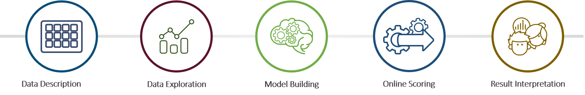
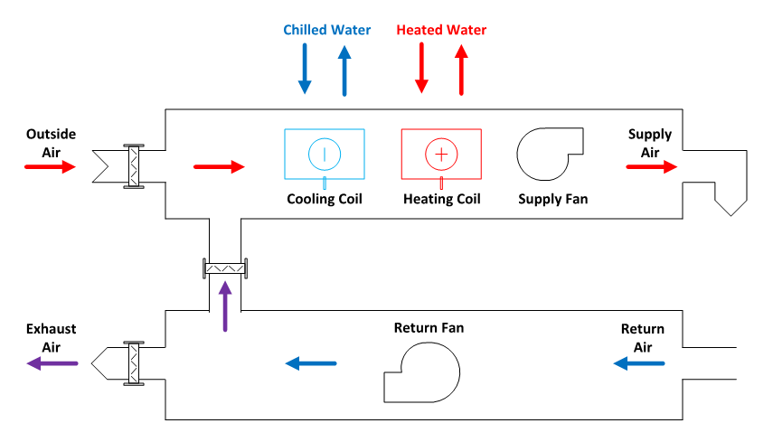
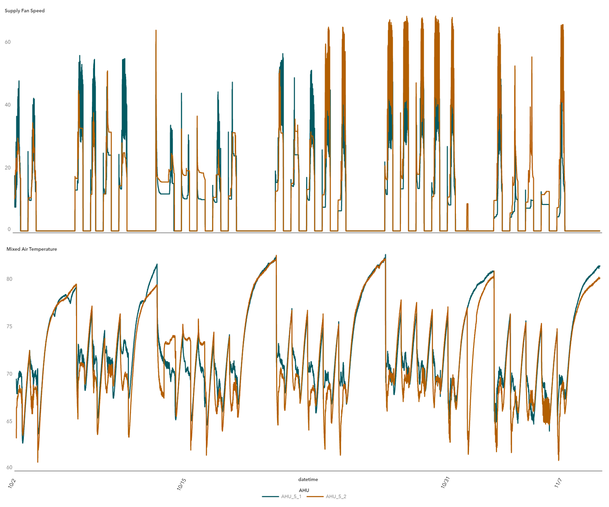
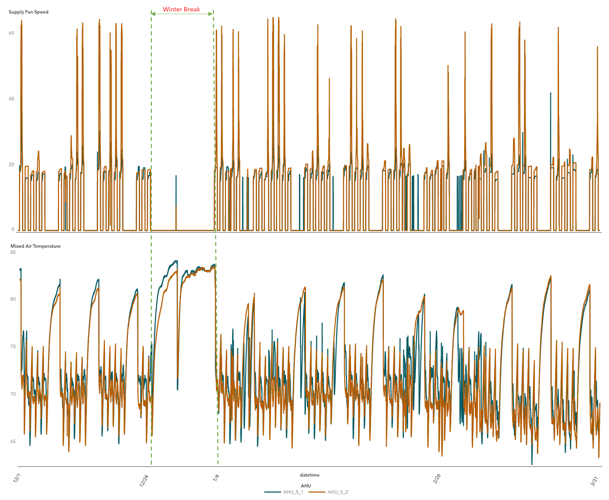
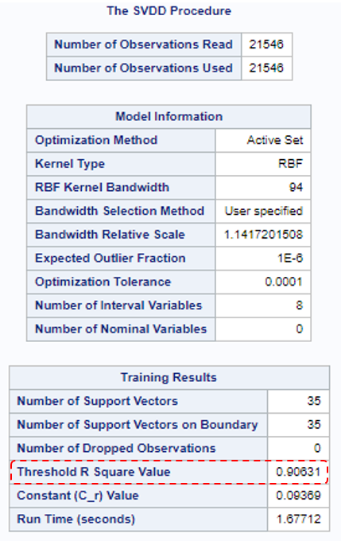
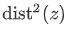
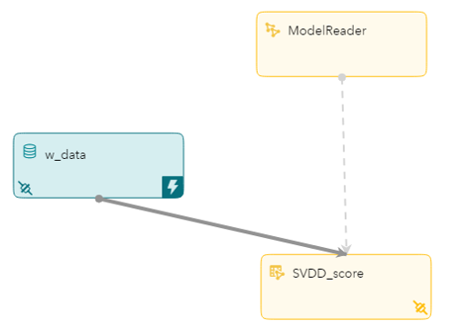
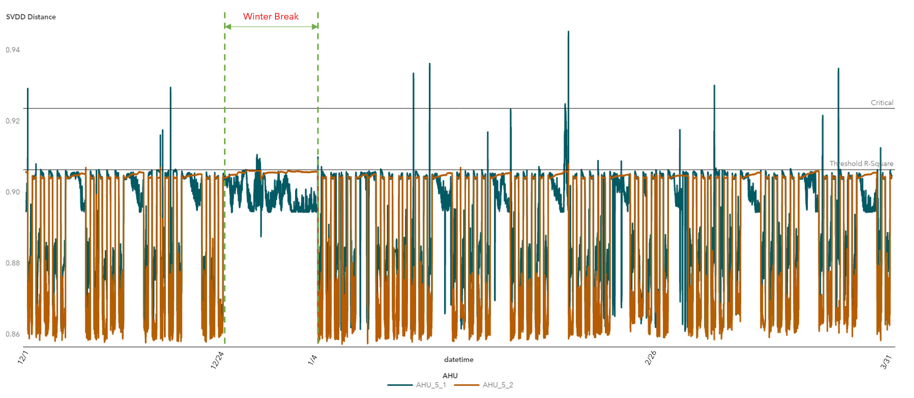

# Anomaly Detection in Air Handling Units

    

## Overview

Learn how to build an anomaly detection model and deploy it for real-time detection of malfunctioning **Air Handling Units (AHUs)**. These AHUs are part of the smart campus heating, ventilating and air-conditioning (HVAC) system.

Key take-aways from the use case: 
* Learn how to build an anomaly detection model using [**Support Vector Data Description (SVDD)**](https://go.documentation.sas.com/?docsetId=casml&docsetVersion=8.5&docsetTarget=casml_svdd_overview.htm&locale=en) algorithm 
* Learn how to deploy an offline model for real-time diagnostics

We will use the [**Support Vector Data Description (SVDD)**](https://go.documentation.sas.com/?docsetId=casml&docsetVersion=8.5&docsetTarget=casml_svdd_overview.htm&locale=en) algorithm, packaged in  [**SAS Visual Data Mining and Machine Learning (VDMML)**](https://support.sas.com/en/software/visual-data-mining-and-machine-learning-support.html#documentation), and deploy it in [**SAS Event Stream Processing Studio (ESP)**](https://go.documentation.sas.com/?cdcId=espcdc&cdcVersion=6.1&docsetId=espstudio&docsetTarget=titlepage.htm&locale=en) to detect outliers in real time using streaming data.

### Prerequisites

List of required software offered as part of [**SAS Analytics for IoT**](https://www.sas.com/en_us/software/analytics-iot.html) 
*  [SAS Visual Analytics](https://support.sas.com/en/software/visual-analytics-support.html#documentation)
*  [SAS Visual Data Mining and Machine Learning](https://support.sas.com/en/software/visual-data-mining-and-machine-learning-support.html#documentation)
*  [SAS Studio](https://support.sas.com/en/software/studio-support.html#documentation)
*  [SAS Event Stream Processing Studio](https://go.documentation.sas.com/?cdcId=espcdc&cdcVersion=6.1&docsetId=espstudio&docsetTarget=titlepage.htm&locale=en)

## Getting Started

This example takes you through the workflow to build an anomaly detection model using tools offered as part of [**SAS Analytics for IoT.**](https://www.sas.com/en_us/software/analytics-iot.html) 



### Data Description 
An Air Handling Unit (AHU) is used to regulate and circulate air as part of a heating, ventilating and air-conditioning (HVAC) system. It takes outside air, regulate it, and supplies it as heated or cooled fresh air using heating and cooling coils via supply fan to the building. It is controlled by factors like outside air temperature, inside air temperature and room or floor occupancy.
In a Smart Campus environment, there is normally one AHU for each floor of every building. Maintenance of these units is critical for efficient HVAC performance. Malfunctions in AHU is usually caused by interrupted air flow and flagged as supply fan failure.

The diagram below shows components of a typical AHU. 



By analyzing AHU performance, units in need of attention can be identified and prioritized.

The data is captured every fifteen minutes from two AHUs, over a span of six months. It is split into 1.) training data - indicating normal operating condition collected for a duration of 1.5 months and 2.) scoring data - which includes anomalous behavior collected over 4 months. 
The training and scoring [data sets](data) consists of sensor values such as mixed air temperature, return air temperature, chilled water valve status, duct pressure, supply fan speed, etc. 

### Data Exploration

##### Training Data 

From analyzing training data (normal operating conditions) in **SAS Visual Analytics**, we see clear patterns in attributes like mixed air temperatures and supply fan speed for both AHUs.
Mixed air temperature increases during business hours and drops in the evenings. 
Similar behavior is observed in other sensors. 
Blue color indicates AHU 1 and orange color indicates AHU 2.



##### Scoring Data 
From analyzing holdout sample (scoring data with anomalous behavior) in **SAS Visual Analytics**, we see few deviations from the pattern seen earlier in attributes like mixed air temperatures and supply fan speed. But any deviation from normal operations is not clearly visible except what we see during the winter break when the building usage is low. This deviation is not a malfunction as the HVAC system was going through a scheduled maintenance.

 

### Model Building

The manual exploration of data in **SAS Visual Analytics** did not indicate all anomalous behavior. We can use **Support Vector Data Description (SVDD)** to detect outliers not clearly visible.

[SVDD](https://go.documentation.sas.com/?docsetId=casml&docsetVersion=8.5&docsetTarget=casml_svdd_overview.htm&locale=en) algorithm is a one-class classification technique that is useful in applications where data that belongs to one class is abundant, but data about any other class is scarce or missing. Fraud detection, equipment health monitoring, and process control are some examples of application areas where the majority of the data belong to one class.

In its simplest form, an SVDD model is obtained by building a minimum-radius hypersphere around the one-class training data. The hypersphere provides a compact spherical description of the training data. This training data description can be used to determine whether a new observation is similar to the training data observations. The distance from any new observation to the hypersphere center is computed and compared with the hypersphere radius. If the distance is more than the radius, the observation is designated as an outlier. Using kernel functions in SVDD formulation provides a more flexible description of training data. Such description is nonspherical and conforms to the geometry of the data. PROC SVDD implements only the flexible data description.

We are using SVDD based K-charts to determine anomalous behavior in AHUs. K-chart is a nonparametric multivariate control chart that is used for statistical process control and can also be used for monitoring equipment health and operating data. It is implemented in two phases: In phase 1, observations from normal operations of the process are collected and are used to train a SVDD model and obtain the threshold r-sqaure value. 

```
/*** Phase 1: Model Training ***/
proc svdd data=mycas.hvac_train ;
    id AHU Datetime;
    input &model_var. /level=interval;
    kernel rbf / bw=94;
    savestate rstore=mycas.hvac_svdd;
 run;
``` 


This model of normal operations is then operationalized in phase 2 for anomaly detection. For each new observation z, its distance value   is computed and compared to the threshold r-sqaure value. Observations for which  > r-sqaure generally indicate something abnormal in the process.

```
/*** Phase 2: Score to get distance value to monitor anomaly ***/
 proc astore;
    score data=mycas.hvac_score
    out=mycas.hvac_svdd_out
    rstore=mycas.hvac_svdd;
    download rstore=mycas.hvac_svdd store='<your path>/hvac_svdd';
 quit;
 
``` 
You can download astore from the model using [PROC ASTORE](https://go.documentation.sas.com/?cdcId=pgmsascdc&cdcVersion=9.4_3.5&docsetId=casml&docsetTarget=casml_astore_overview.htm&locale=en). This astore file can then be used in ESP for real-time anomaly detection.

Learn more about PROC SVDD [here.](https://go.documentation.sas.com/?cdcId=pgmsascdc&cdcVersion=9.4_3.5&docsetId=casml&docsetTarget=casml_svdd_overview.htm&locale=en)

### Online Scoring

We will use **SAS Event Stream Processing Studio** to deploy the SVDD model developed offline and score it online for real-time anomaly detection.



See detailed steps to [build and test](/docs/BuildModel.md) ESP project.

### Result Interpretation

Below we are visualizing results from scoring SVDD model in ESP in **SAS Visual Analytics** for the two AHUs. 

The figures below show SVDD distance ( value) plotted against datetime. The horizontal reference line indicates threshold r-sqaure value (0.90631). This threshold value can be used as benchmark for indicating anomalous behavior. On top of the benchmark, by calculating 3-sigma values we can set thresholds for warning, alert and critical conditions for AHUs.
It detects outliers in AHU 1 (blue), AHU 2 (orange) is operating normally. The deviation observed during winter break is picked up by SVDD as a minor outlier for AHU 1 since the system was going though a scheduled maintenance. 

In addition, we see 13 events from AHU 1 with SVDD distance greater than the critical threshold (in this scenario critical threshold is 2-sigma value calculated from training data). Using SVDD algorithm these anomalies can be detected and acted upon.



### Summary

**SAS Analytics for IoT** offers an optimized IoT Solution ecosystem and addresses the entire analytical lifecycle. Read more about **SAS Analytics for IoT** [here.](https://www.sas.com/en_us/software/analytics-iot.html) 

## Contributing

This repository is not open for external contributions.

## License

This project is licensed under the [Apache 2.0 License](LICENSE).

## Additional Resources

* SAS Event Stream Processing Streamviewer [Documentation](https://go.documentation.sas.com/?cdcId=espcdc&cdcVersion=6.1&docsetId=espvisualize&docsetTarget=titlepage.htm&locale=en)
