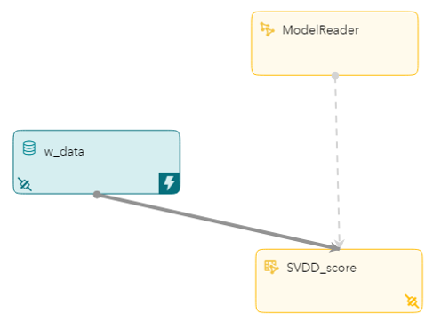
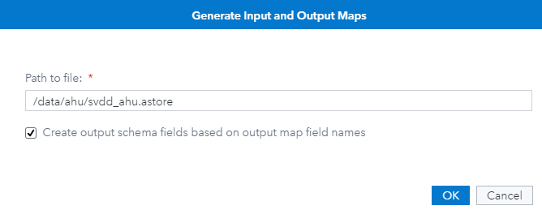

# Build and Test Streaming model in SAS ESP Studio

The following steps assume that you have access to SAS Event Stream Processing Studio and authorized to start ESP server.

## 1. Required Steps
1. Access SAS Event Stream Processing Studio by opening following URL: https://`your host`/SASEventStreamProcessingStudio
The host is the system where SAS Event Stream Processing Studio is installed.
2. Start the Event Stream Processing Server. See the [link](https://go.documentation.sas.com/?cdcId=espcdc&cdcVersion=6.1&docsetId=espstudio&docsetTarget=n02795wpw65f79n1l8kls27e84l1.htm&locale=en#n0zk1grxfc2fron162rgxvg63dip) for details.
3. Open **ESP Servers** page to configure a new ESP server. 
   *  Click on ‘Add ESP Server’
   *  Add name to identify server
   *  Enter hostname
   *  Add HTTP Port
   *  Add description or tag if required.

## 2.a (Option 1) Upload Project

1.  Go to **Projects** page
    *  Click on **More actions**
    *  Select **Upload Projects** 
    *  Navigate to the location that contains the downloaded copy of [hvac.xml](../project/HVAC.xml) by clicking on **Upload Project files**
    *  Close and return to Project page
    *  New project named HVAC is created, double click to open
    *  Review properties of source and calculate windows
    *  Make following changes
        *  Change path to under Fsname in Input Data Connector to reflect accessible location
         
        *  Similarly update path of Subscriber connector to reflect accessible location
    * Save the Project
    * Follow **Sections 3-4** as described below. 
   
## 2.b (Option 2) Create Project
1. Go to **Projects** page
   *  Create new project
   *  Add a unique name for the project
   *  Optional: add description, tag. 
   *  Click OK
2. **SAS Event Stream Processing Studio Modeler** appears
   
    ###### **a. Configure Source Window**
    *  Add Source window from Input Streams to workspace
    *  Add name, description 
    *  Select *‘Stateful (pi_EMPTY)’* under **State and Event Type**. Check box for ‘Accept only “Insert” events’ and 'Automatically generate the key field' 
    *  Expand **Input Data (Publisher) Connectors**
    *  Add new connector
    *  Add details to receive data from csv file 
      *  Copy paste or type the path to the [hvac_scr.csv](../data/hvac_scr.csv) file under Fsname and select Fstype as csv
       
      *  Click ‘All Properties’ and add details from the table below and click ‘OK’
      
            | Property | Value |
            | :------ | :------: |
            | dateformat | %d%b%y:%k:%M:%S |
            | header | 1 | 
            | noautogenfield | true | 
            | addcsvopcode | true | 
            | addcsvflags | normal | 
            
    *  Click on Output schema on the right pane and edit rows   
    *  Click on Import Schema and select XML snippet.
        
    *  Copy the xml below and paste it in the window. 
      ``` 
       <fields>
       <field name="ID" type="int64" key="true"/>
       <field name="Datetime" type="stamp"/>
       <field name="AHU" type="string"/>
       <field name="CHW_VALVE" type="double"/>
       <field name="CHW_VALVE_POSIT" type="double"/>
       <field name="DIS_AIR_TEMP" type="double"/>
       <field name="DUCT_PRESS_ACTV" type="double"/>
       <field name="MAX_CO2_VAL" type="double"/>
       <field name="MIXED_AIR_TEMP" type="double"/>
       <field name="RTRN_AIR_TEMP" type="double"/>
       <field name="SUPPL_FAN_SP" type="double"/>
       </fields>
      ```
      
    ###### **b. Configure Model Reader Window**
    *  Add Model Reader window under Analytics to workspace
    *  Select ASTORE as Model type under Settings and check box for 'Load a model when project is started'
    *  Add location to point to locally saved [astore file](../project/hvac_svdd) under reference property.
    *  Add ASTORE specific properties as shown below (*Tip: click on New Row* ) 
       
        
       
    ###### **c. Configure Score Window**  
    *  Add Score window under Analytics to workspace
    *  Connect the Source and Model Reader with Score window
        
         
    *  Select Name and Description 
    *  Expand Settings
       *  Select ‘Offline’ under Model source
       *  Select 'ASTORE' under Model Type
       *  Click on 'Generate Input and Output maps from ASTORE file'
       
       
       
       *  Add path to locally saved [astore file](project/hvac_svdd)
       *  Check box for 'Create output schema fields based on output map fields names' and select OK.
       *  Expand Input and Output Map to review the properties.
            *  Select Datetime under Field to map the Role.
            
       
       
    *  Go to **Output Schema**, click on 'Edit rows' 
       *  Click on Import Schema and copy fields from Input Schema that you may want to keep in the output results. 
       
       
       
    *  Save the Project 
    *  Follow **Sections 3-4** as described below.
    
## 3. *Optional*- Add Subscriber Connector to output results
*  Expand **Subscriber Connectors**
    *  Add new connector
    *  Add details to send data to a csv file 
    *  Check box for ‘Snapshot’
    *  Copy paste or type the path to the csv file under Fsname and select Fstype as csv
    *  Click on ‘All Properties’ and select ‘full’ for header
*  Save the Project  

## 4. Test the Project
   *  Click on **Enter Test Mode**
   *  Click on **Run Test**
   *  The image below shows the streaming data coming in and results from SVDD. 
     


***Tip:*** Check [sample project template](../project/hvac.xml) to compare project properties.


